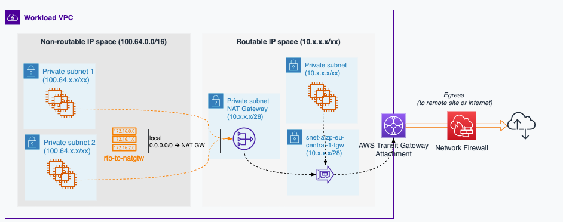

# **odp-adb-prerequisites-template**

## **Overview**
---

To deploy Databricks clusters, you must have sets of compute engins (EC2) in your own Virtual Private Cloud (VPC) then give permissions to that set of EC2 to be related to your workspace then perform computing tasks.

This document describes the process of setting up all prerequisites in your VPC before going further.

This include Networks - IAM and Storage setup.

## **Architecture**
---



## **Principal Components Description**
---

**AWS Landing Zone** VPC provides by AWS Landing Zone team to give normalize environment to squad

**Network ACL** Access control list is a set of perssionns applied to VPC to allow/deny certains protocols

**Security Group** Controls traffic that is allowed to reach resources

**Instance profile** Role assumed by instance to perform tasks based on what is added in permissions


<!-- GETTING STARTED -->
## **Getting Started**
---

This repository contains templates for terraform and github actions workflows. 


### **Layers**

Infrastructure is rollout by successively deploying different layers. Each layer grouping resources. Layers need to be deployed in a specific order (Network -> IAM -> Storage)

1. Scripts  

    In this part you can add script to custom your deployment

2. Terraform
   
   1. 000-network 

    You use the Landing Zone provides by AWS Teams to put in place your network to host Databricks clusters.This LZ must only hosts Databricks infrastructure.

        - Create two Subnets for Datbricks clusters included in 100.64.0.0/16
        - Create Nat Gateway with private connectivity type include in range 10.0.0.0/16 in another Subnet
        - Create Route Table corresponding to Nat Gateway then associate the two Databricks Subnets to route all their traffic via this Route Table.  
        - Create Security Group to control inbound and outbound traffic for the instances
        - Add rules (inbound and outbound) to that Security Group to allow all udp,tcp,mysql,https and custom tcp traffic
        - Create Network ACL to control all traffic in the network
        - Add rules (inbound and outbound) to that Network ACL to allow all udp,tcp,mysql,https and custom tcp traffic
        - Create two VPC endpoints by using Databricks service name ["com.amazonaws.vpce.eu-central-1.vpce-svc-081f78503812597f7", "com.amazonaws.vpce.eu-central-1.vpce-svc-08e5dfca9572c85c4"]. One for Workspace (including REST API) and the second for Secure cluster connectivity relay


    2. 100-iam 
   
      You must set up the AWS cross-account IAM role so that Databricks control plane can perform certain tasks in your AWS account, such as creating new Databricks Runtime clusters.

        - Create inline policy to grant EC2 to perform all tasks
        - Append permissions boundary to your role to be aligned with AWS LZ policies schema and attach your AWS account ID
        - Policy to give to Databricks to assume necessary role

    
    3. 200-storage
   
      Create and configure an S3 bucket to store a limited set of Databricks workspace information such as libraries, some logs, and notebook version history

        - Create S3 Bucket and choose name with certains restrictions:
            * Unique name 
            * More than 3 and less than 63 characters
            * No upper characters
            * Can start with numbers
        -  Add versioning to your bucket
        -  Create bucket acl and make it private
        -  Block all public access to your bucket
        -  Add policy to your bucket to grant Databricks to make these actions ["s3:GetObject","s3:GetObjectVersion","s3:PutObject","s3:DeleteObject","s3:ListBucket","s3:GetBucketLocation"] in all objects in your bucket

#### **Pre requisites**

Before being able to deploy this infrastructure from your local computer you need to setup the following tools:

1. AWS CLI
    You will find instructions regarding AWS CLI setup at the following link: https://docs.aws.amazon.com/cli/latest/userguide/getting-started-install.html

2. Terraform
    You will find instructions regarding Terraform setup at the following link: https://learn.hashicorp.com/tutorials/terraform/install-cli

#### **Terraform deployment**

1. Login to AWS portal  
  here the link : https://totalenergies.awsapps.com/start#/

2. Choose the role you want to assume (Contributor/Owner)


3. Click on 'Command line or programmatic access'


4. Choose one of these Options to set up AWS environment varaiable to get access to   AWS CLI
   * Option 1 : Set AWS environment variables
   * Option 2: Add a profile to your AWS credentials file  
   * Option 3: Use individual values in your AWS service client 
 
5. Terraform init  
  This step needs to be replicated for each layer
    ```
    cd terraform/000-network
    terraform init"
    ```

6. Terraform fmt
  This step needs to be replicated for each layer
    ```
    cd terraform/000-network
    terraform fmt"
    ```

7. Terraform validate
   This step needs to be replicated for each layer
    ```
    cd terraform/000-network
    terraform validate"
    ```


8. Terraform apply  
  This step needs to be replicated for each layer
    ```
    cd terraform/000-network
    terraform apply"
    ```


### **CI/CD deployment**

The workflow is set os checks which starts with .github/actions/terraform/ then on .github/workflows/ by browsing files

- Triggers
   - Path : Any file changed 
   - On Pull request **creation**: Only Dev will be deploy
   - On Pull requestion **completion** on **main** : all environments will be deployed

   - Global variable

- Jobs \
There are one job by environment and each job contains :
  - Job environment variables
  - Job dependencies and needs
  - Job steps :
    - Check backend step
    - **tf_validate_apply** Github Action for each layer 
    - **tf_validate_apply** Github Action \
          This composite action contains :  
            - Checkout step  
            - Terraform install step  
            - Terraform init step  
            - Terraform validate step  
            - Terraform apply step    

- Item to update for your use case :
  - Set github environments and environment variables on repo settings
    - ARM_CLIENT_ID
    - ARM_CLIENT_SECRET
    - ARM_SUBSCRIPTION_ID
    - ARM_TENANT_ID
    - AZURE_CREDENTIALS, it is a json object like this
    ```
    {
          "clientId"          : "xxxx"
          ,"clientSecret"     : "xxxx"
          ,"subscriptionId"   : "xxxx"
          ,"tenantId"         : "xxxx"
    }
    ```

    - Update workflow fields :
    - Workflow name
    - Workflow global environment varibles
      - tf_state_prefix : Use to préfix layer tf state ** MAKE SURE DO NOT USE EXISTING PREFIX NAME **
    - For each job
      - Update layersToRun variable to specify which layer will be run.
      - Duplicate and update **tf_validate_apply** Github Action for each layer 
    - For each **tf_validate_apply** Github Action : 
      - Action name
      - Action if condition
      - Action input layer_path that represents the layer folder name.
      - Action input state_file that represents the name of tf state store in the mutualize backend.** MAKE SURE DO NOT USE EXISTING TF STATE NAME **.
      ```
      - name: Resource group deployment # To update 
        if: ${{ contains( env.layersToRun , 'terraform_rg_job') }} # To update 
        uses: ./.github/actions/tf_validate_apply
        with:
          layer_path      : '100-resource-group' # To update 
          state_file      : '${{ env.tf_state_prefix }}_rg_state' # To update 
          env             : '${{ env.lzenv }}'
          tf_rg           : 'rg${{ env.lzenv }}-lzbackend-infra-weu'
          tf_sa_name      : 'st${{ env.lzenv }}lzbackendinfra'
          tf_sa_container : 'terraform'
          tf_apply        : true
      ```

## **Testing**  
---

To validate the right deployement on this infrastructure:

1. Check resources existence in Azure Portal  


2. Check Self hosted Integration Runtime status  

  

3. Check drivers setup within virtual machine  

  

- Denodo drivers => DenodoODBC_x64
- Jre drivers => Java 8 Update 241 (64-bit)
- Jdbc drivers => psqlODBC_x64
## **Know issues**  
---
In case you face the following error message related to diagnostic settings:  
  
manually remove the diagnostic setting on the mentionned resource through portal, then re run your scripts.

